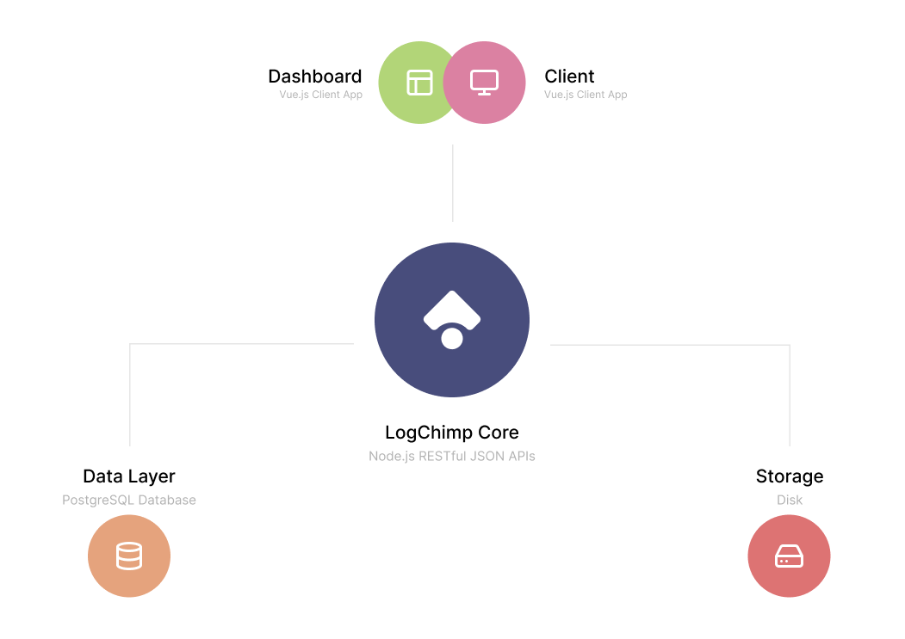

LogChimp is an independent system built on a modern technology stack. It utilizes Node.js to power its robust JSON API and relies solely on the PostgreSQL database as its data storage layer. Complemented by a beautifully crafted client app written in Vue.js with Typescript, LogChimp offers a powerful dashboard, providing users with a comprehensive experience.

A high-level overview of LogChimp's architecture is shown below:

These five components work together seamlessly to ensure the smooth functioning of every LogChimp site:

1. [Robust REST APIs](/docs/architecture/api)
2. Beautiful Vue.js client app
3. Powerful Dashboard
4. PostgreSQL Database
5. Disk storage space

## Node Environment

LogChimp supports three environments: `development`, `testing`, and `production`.

Public LogChimp sites should always run in **production** mode, while the `development` environment is used for the local development of LogChimp. The `testing` environment is exclusively employed in CI/CD pipelines for running tests.
