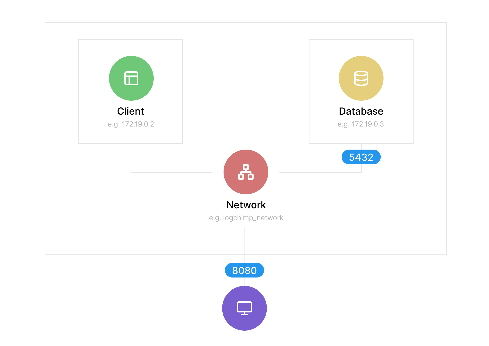

[LogChimp docker image](https://github.com/orgs/logchimp/packages/container/package/logchimp) is an official package maintained by core team.

<Alert type="warning">
  Experience with [Docker Compose](https://docs.docker.com/compose/) is required.
</Alert>

If `Docker` or `Docker Compose` is not installed on your machine/server, refer to [Docker Compose](https://docs.docker.com/engine/install/) installation docs.

You can easily kick-start your LogChimp site in 3 easy steps.

##### Step 1. Create docker network

Here we're creating a network which will be used by both database and LogChimp application.

```bash
docker network create -d bridge logchimp_network
```

##### Step 2. Run `postgres` database

```bash
docker run -d \
	--name db \
	-p 5000:5432 \
	--net logchimp_network \
	-e POSTGRES_DB=database_name \
	-e POSTGRES_USER=database_user \
	-e POSTGRES_PASSWORD=strong_password \
	postgres:12.4
```

##### Step 3. Run `logchimp` application

Make sure you're using the correct url for logchimp docker image `ghcr.io/logchimp/logchimp`.

As for postgres environment variable, it should match in both step 2 and step 3.

Replace `Fig8=Diq1` in `SECRET_KEY=Fig8=Diq1` with a string random hash or ID to improve your LogChimp site security.

Notice, we're exposing two ports here, the first one `8080:8080` is for frontend and second `3000:3000` is for backend.

```bash
docker run -d \
	--name your-app-name \
	-p 8080:8080 \
	-p 3000:3000 \
	--net logchimp_network \
	-e PG_HOST=db \
	-e PG_USER=database_user \
	-e PG_DATABASE=database_name \
	-e PG_PASSWORD=strong_password \
	-e PG_PORT=5432 \
	-e SECRET_KEY=Fig8=Diq1 \
	ghcr.io/logchimp/logchimp
```

After running these command successfully, you can access your LogChimp site at `http://localhost:8080/`.

---

Here's an LogChimp Docker image structure for you to understand _(if you're curious)_, what's happening behind the scenes.



### Resources

- [LogChimp Docker image on GitHub](https://github.com/orgs/logchimp/packages)
- Reporting issues
  - [logchimp-server](https://github.com/logchimp/logchimp)
  - [logchimp-theme](https://github.com/logchimp/theme)
