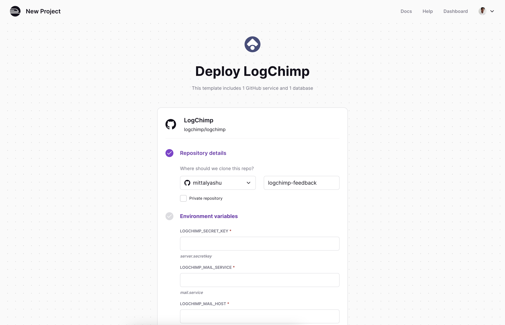
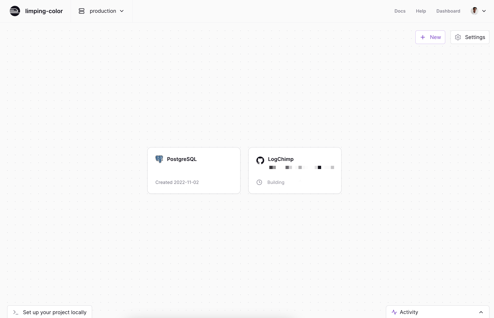
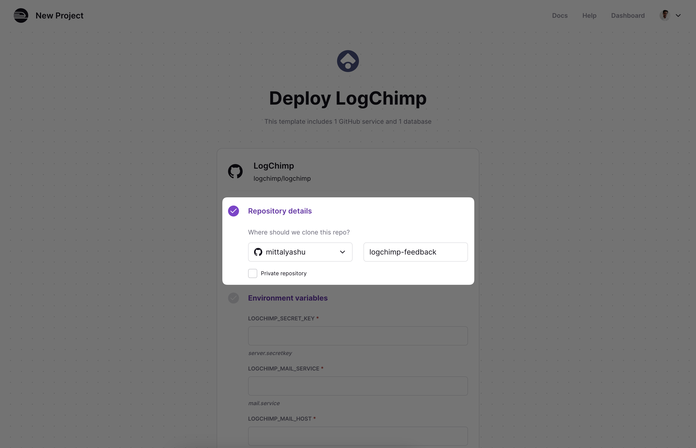
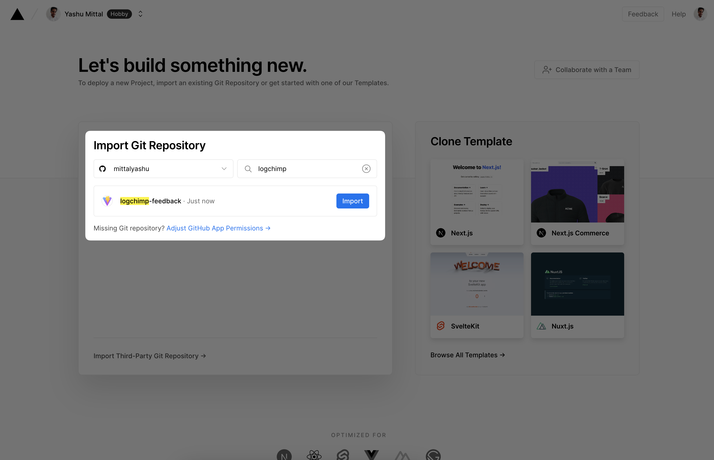
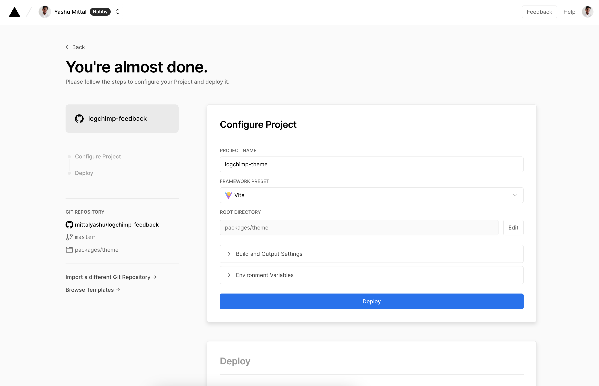
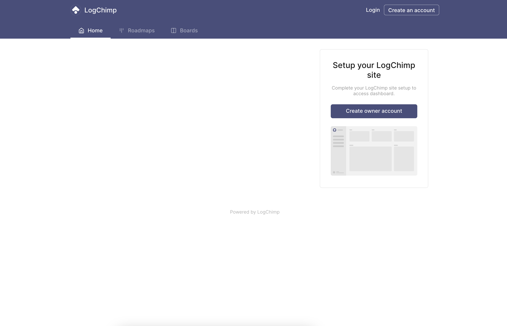
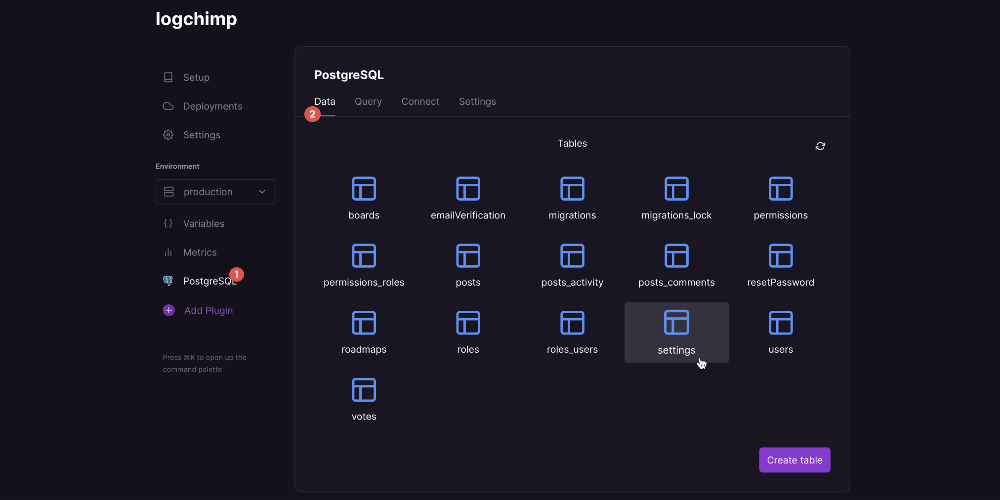
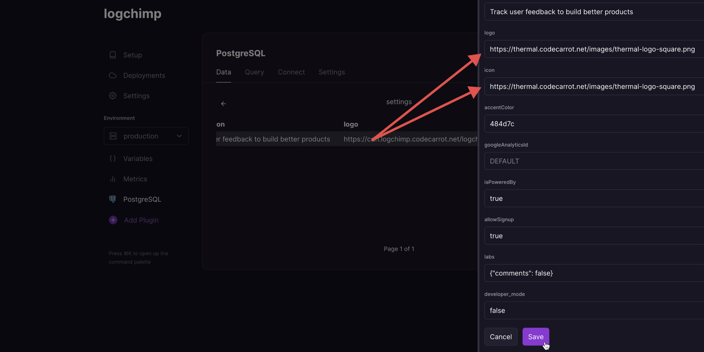
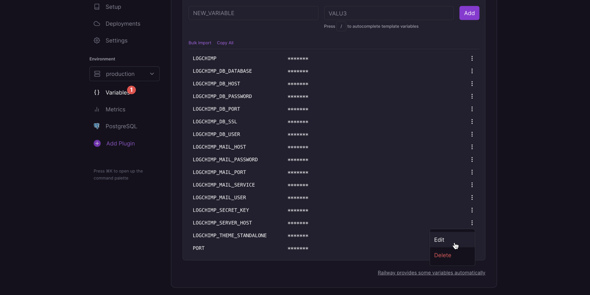
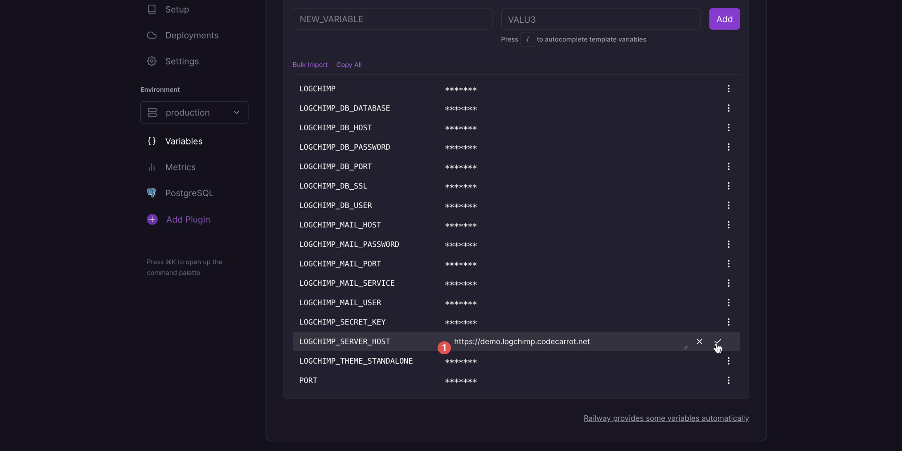

import { Alert } from "../../../src/components/Documentation/Alert.tsx"

<Alert type="warning">
  By default, it will deploy directly from `master` branch of [logchimp/logchimp](https://github.com/logchimp/logchimp). You can always create a [custom Railway template](https://railway.app/button) to deploy the required LogChimp version.
</Alert>

There are many ways to [install LogChimp](/docs/install), with Railway, you can get started with few easy steps, click the button[^1], enter environment variables and hit deploy.

The first step is to deploy the LogChimp APIs followed by LogChimp Theme.

## APIs

Clicking "Deploy on Railway" will auto provision a PostgreSQL database, and deploy a LogChimp backend for you.

  [](https://railway.app/new/template/3Bm-Un?referralCode=mittalyashu)

Enter the required environment variables and click **Deploy**.

  

  Railway will automatically provisioning a PostgreSQL database and deploy LogChimp API service for you.

  

## Theme    

Now its time to deploy the theme.

The theme is build as a generated SPA _(single page application)_, making it easier to deploy on any CDN _(content delivery network)_.

* AWS Cloudfront
* Vercel
* Netlify
* [Render](/docs/install/render)

_Just to name a few..._

Here we'll use Vercel as an example to deploy the theme. Feel free to choose any other option of your choice.

Go to vercel dashboard and create a new project, select the git provider where you cloned the LogChimp repository using Railway.



Search with the same repository name as used in Railway and click **import**.



There is no requirement for any configuration. Vercel will automatically detech the framework presets and apply base configuration for deploying.



But feel free to look around and tweak the configuration accordingly and hit **Deploy**.


The last step is to add a API rewrite for your client app, in your source code by create a new file `vercel.json` in `packages/theme` directory.

```json
{
  "rewrites": [
    {
      "source": "/api/:path*",
      "destination": "https://<subdomain>.up.railway.app/api/:path*"
    },
  ]
}
```

<Alert type="warning">
  Replace the part of destination URL `https://<subdomain>.up.railway.app` with LogChimp API URL from railway.
</Alert>

and there you go... 🚄

Your LogChimp site is ready to accept **your customers feedback** with ease.



## FAQ

### How to upload custom Logo?

Currently, LogChimp doesn’t have integration with third-party services to upload images and only support filesystem and the default filesystem of Railway is ephemeral, meaning the data isn’t persisted across deploys and restarts.

The trick is to directly update the LogChimp site logo URL directly from database, upload your logo to any image hosting service (for example, AWS S3 bucket), and grab the image url.

1. Go to PostgreSQL plugin > Data tab > click "settings" database table
	

2. Click on the first row in "settings" table, that should open that row in edit mode
	Paste the image url you've copied and click the save button.
	

### How to add custom domain?

You can even attach a **[custom domain](https://docs.railway.app/deployment/custom-domains)** to your LogChimp site.

1. Go to variables page and click on edit button from dropdown for the environment variable of `LOGCHIMP_SERVER_HOST`.
	

2. Enter your custom domain and click on checkmark icon.
	

	<Alert type="warning">
		Make sure to prefix `https://` protocol before your custom domain.
	</Alert>

[^1]: The above link contains a referral code which gives referral credits to [@mittalyashu](https://github.com/mittalyashu).
