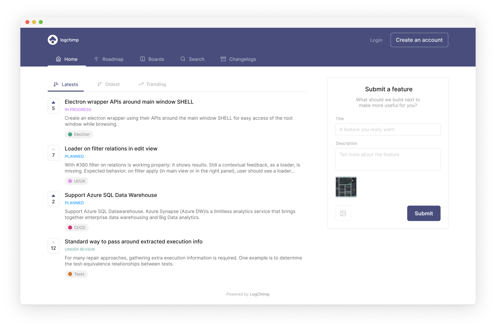

<Alert type="tip" title="Help us improve!">
**NOTE:** The documentation is very new and may contain some gaps. Please help us fill them by opening issues or, better yet, pull requests when you think something could be explained better.
</Alert>

LogChimp is an open-source software for capturing your customers' feedback and informing your product decisions.

## Quick Start

- Learn more about LogChimp's architecture and key features.
- [Set up LogChimp](/docs/install) on your own servers.
- We would love to see your contributions to LogChimp. Get more information on [how to contribute](/docs/contributing).
