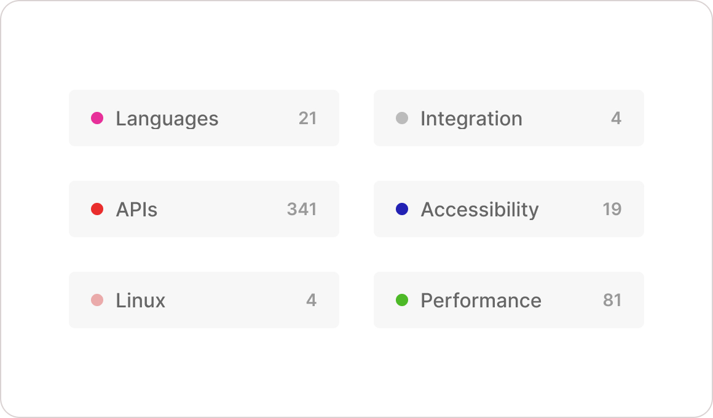

## Overview

Boards can set as **public** or **private**. Public boards are visible in your LogChimp site and anyone on the internet.

## Configure

Go to `<logchimp-site.com>/dashboard/boards` to **create**, **edit**, and **delete** boards.

Until [roamdaps](/guide/roadmaps) you cannot re-arrange the order of boards.
