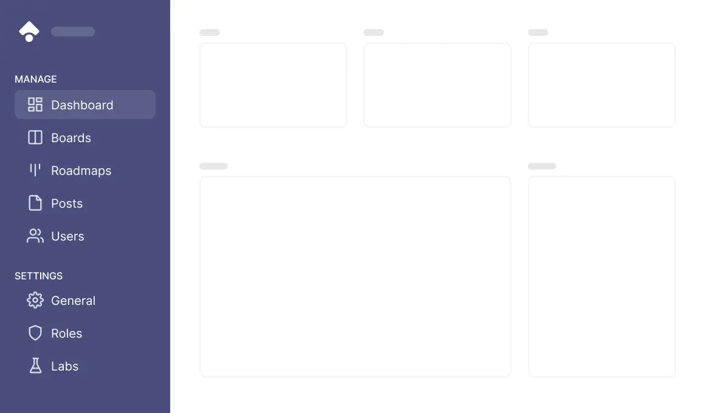

The dashboard is your home in LogChimp and where all the post, board, roadmap and interactions live. Within the dashboard, you can create boards, manage roadmap, assign roles and more.

<Alert type="warning">
	**NOTE:** You need to have `dashboard:read` permission to access the dashboard.
</Alert>
