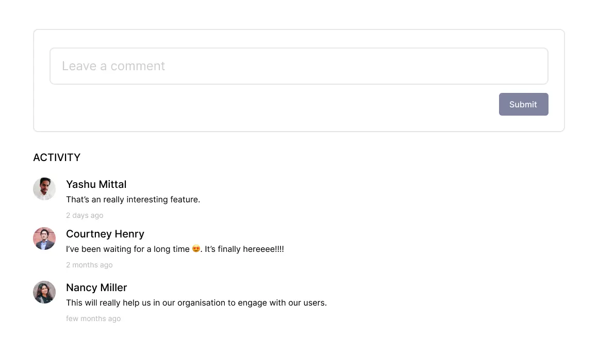

## Comments

<Alert type="warning">
**NOTE:** This feature is currently in **BETA**, you can enable this feature from settings [labs](/guide/dashboard/labs).
</Alert>

Comments allow you to communicate directly with your customers, keeping your conversation context in-tact and on track in a single view.
