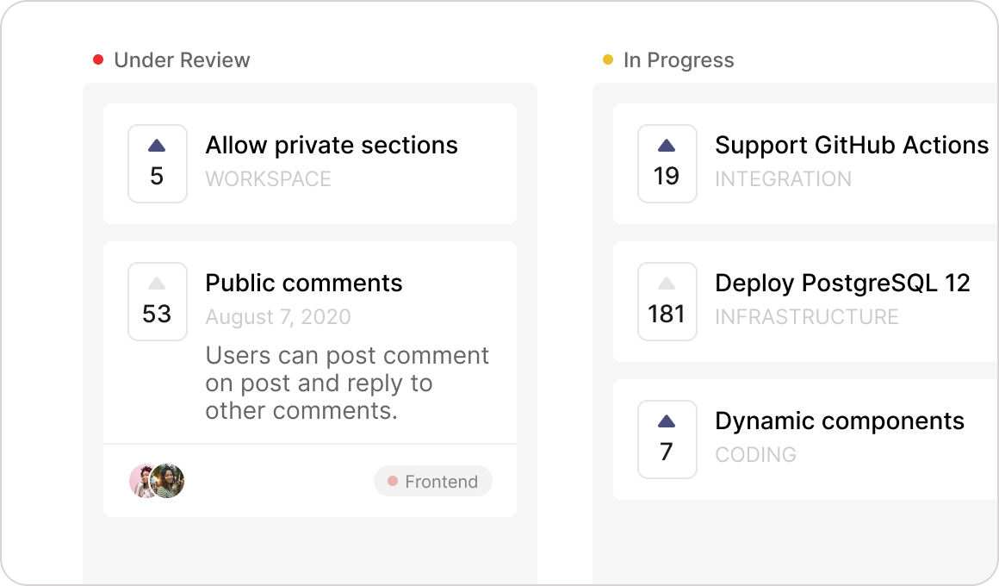

import { Alert } from "../../src/components/Documentation/Alert.tsx"

## Overview

Roadmaps add a high-level structure that organizes your posts in your site. Create custom roadmaps to organize and show the status of the posts.

You can control the roadmap visibility for your customers and show your product progress to everyone at all times.

Roadmaps help you make decisions and plan as you see projects and their expected completion dates on the timeline. The roadmap also gives meaningful context to daily project work which can help motivate the team members doing it.

## Configure

Go to `<logchimp-site.com>/dashboard/roadmaps` to **create**, **edit**, and **delete** roadmaps.
 

<Alert type="tip">
You can even re-arrange the order of your roadmap from dashboard.
</Alert>
